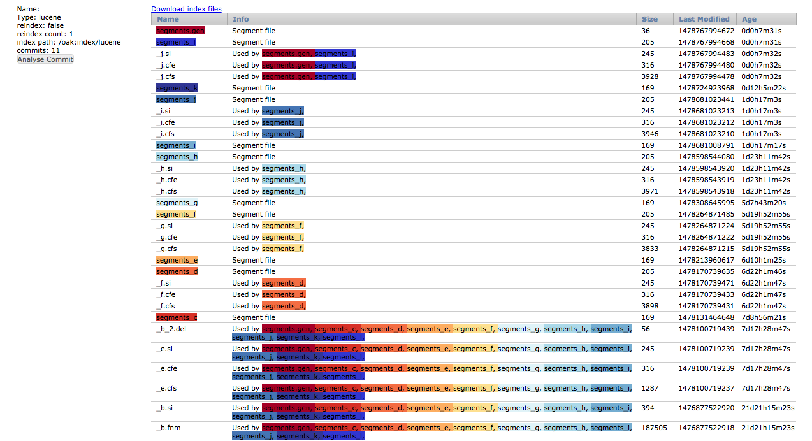

# OakUI

Oak UI is a Sling Web Console that gives administrative access to internals of Oak. Its built as a single page application
using AngularJS interacting with the Sling instance over http/json.

Initially it support inspecting and downloading lucene indexes. 

More to come over time ......

# Rapid Cycle development

Sometimes, developing UI in OSGi bundles can be slow. The main servlet delivers the UI from resources in the classpath.
To allow rapid edit-save-refresh-repeat cycles, the servlet will load resources from a directory named "fsresources" in 
the working directory of the sling/aem container. If you create a sym link to map src/main/resources/res/ui you can develop
the Angular JS SPA that is Oak UI without having to recompile or reload the bundle. When json feeds are changed, the bundle 
will need to be reloaded, ie on AEM mvn clean install sling:install -Dsling.url=http://localhost:4502/system/console  or 
on Sling mvn clean install sling:install